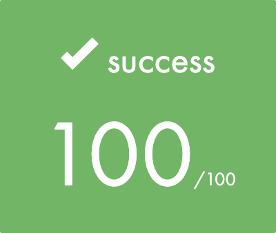
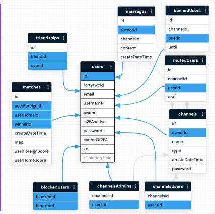

  

  <h2 align="center">ft_transcendence</h2>
  <h3 align="center">Built with Node, React, Postgres, Socket.io, Konvajs & Material-UI</h3>

  

    This project is about creating a website for the mighty Pong contest!
     
     
    <a href="./assets/en.subject.pdf">English Subject </a>
  

 

  

## Table of contents

- [Quick start](#quick-start)
- [The stack](#the-stack)
- [Creators](#creators)

## Quick start

Thanks to this website, users will play Pong with others. featuring a nice user interface, a chat, and real-time multiplayer online games!
Two-factor authentication can be enable via google authenticator.

Wireframes designed beforehand with figma: [UX](https://www.figma.com/file/2p2laPUsfhpXwMmBWwHetP/Transcendence?node-id=0%3A1&t=zHXCE1uSwvsu1hXy-1)

## The stack

### Containers
* [Docker](https://www.docker.com/)

### Back
* [Node](https://nodejs.org/en/)
* [Nestjs](https://nestjs.com/)
* [Postgres](https://www.postgresql.org/)
* [Socket.io](https://socket.io/) : real-time engine (chat + game + notifications)

### Front
* [React](https://reactjs.org/)
* [Material-Ui](https://material-ui.com/) : React UI framework
* [Konvajs](https://konvajs.org/)

### API we used
* [42's API](https://api.intra.42.fr/apidoc)

## Creators

**abonnel**

- <https://github.com/anyaa6>

**victor-chevillotte**

- <https://github.com/victor-chevillotte>

**llecoq**

- <https://github.com/llecoq>
